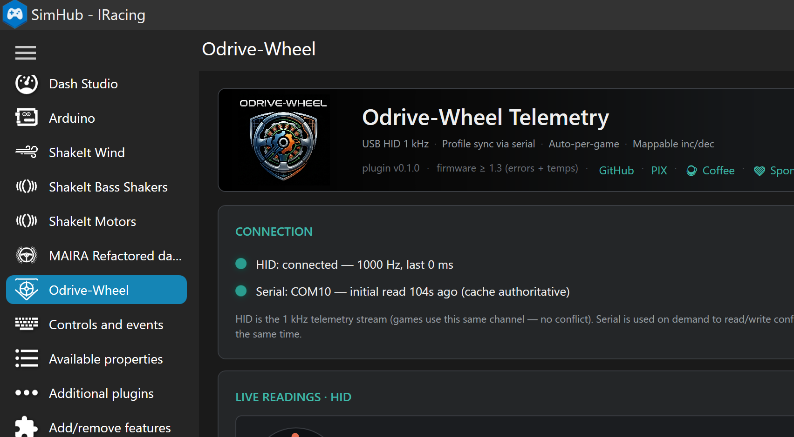
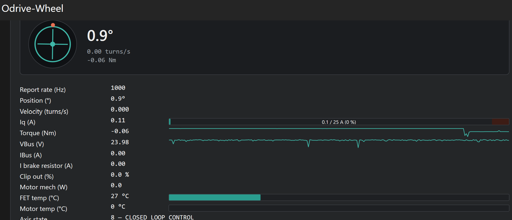
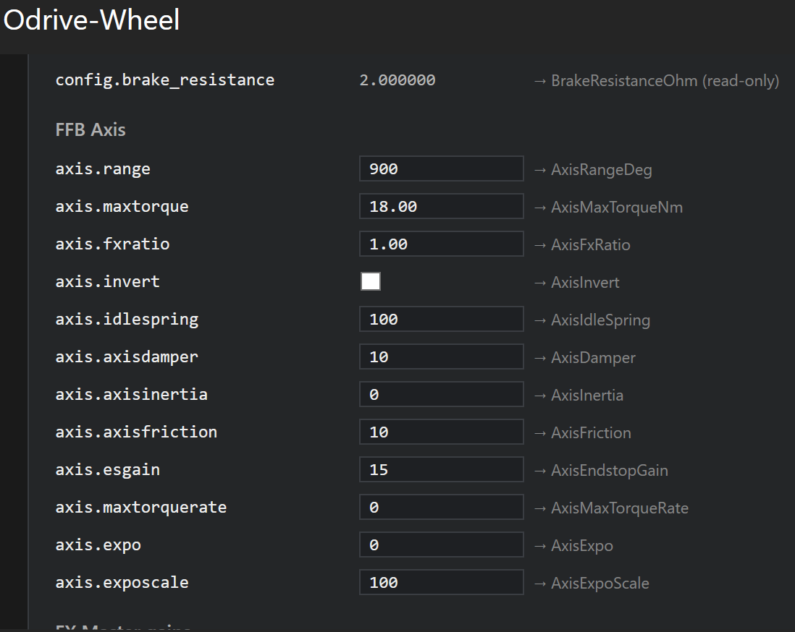
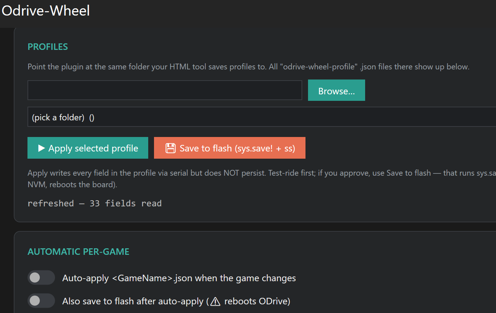

# Odrive-Wheel SimHub Plugin — User Manual

This plugin brings your Odrive-Wheel board into SimHub. It reads live
telemetry over USB HID at the firmware's native 1 kHz rate, syncs FFB
tuning parameters over serial, and exposes everything as SimHub properties
and mappable actions for dashboards and button-box control.

> **What is Odrive-Wheel?** An open direct-drive sim racing wheel firmware
> that combines the ODrive motor controller with OpenFFBoard's Force
> Feedback stack, running on the MKS XDrive Mini or ODESC V4.2 boards.
> Repo: <https://github.com/eagabriel/Odrive-Wheel>

---

## Table of contents

1. [Features at a glance](#features-at-a-glance)
2. [System requirements](#system-requirements)
3. [Install](#install)
4. [First launch](#first-launch)
5. [Panel walkthrough](#panel-walkthrough)
6. [Property reference](#property-reference)
7. [Mappable actions](#mappable-actions)
8. [Profile workflow](#profile-workflow)
9. [Save to flash](#save-to-flash)
10. [Auto-per-game](#auto-per-game)
11. [Update the plugin](#update-the-plugin)
12. [Troubleshooting](#troubleshooting)
13. [Coexistence with the HTML tool](#coexistence-with-the-html-tool)
14. [Uninstall](#uninstall)

---

## Features at a glance

- **1 kHz HID telemetry** — wheel position, velocity, Iq, torque, VBus,
  IBus, brake resistor current, FET/motor temperatures, ODrive errors.
- **Live serial sync** — every FFB parameter that ends up in a profile
  (max torque, EQ gains, filter Q/frequency, current limit, etc.) is
  read once on connect and cached; edits made in the panel commit
  through the serial CLI.
- **Profile support** — pick the same folder your HTML tool saves
  profiles to; the plugin lists the `.json` files and can apply any of
  them with a click.
- **Auto-per-game** — optionally applies `<GameName>.json` when SimHub
  detects a game change.
- **21 mappable actions** — increment/decrement of key live-tuning
  properties (FX master, FX ratio, 3-band EQ) plus a Zero-wheel-position
  action. Bind these to your wheel's buttons in **Controls and events**.
- **Rich in-panel visuals** — wheel-position gauge with rotating marker,
  Iq/Torque scope, colour-coded temperature bars, current-vs-limit meter,
  sparklines for VBus and torque, error decoder that translates ODrive
  bitmasks into readable names.

---

## System requirements

- **Windows 10/11**
- **SimHub 9.x** installed at `C:\Program Files (x86)\SimHub` (or point
  the build to a custom install path)
- **.NET Framework 4.8 runtime** (included with Windows 10 1903+ and Windows 11)
- An **Odrive-Wheel board** running firmware **v1.3 or newer** —
  identifiable in Windows Device Manager as HID `VID_1209&PID_0D40`.
  Older firmware (v1.1/1.2) works too, but temperature and error
  fields stay empty.

---

## Install

### Option A — Prebuilt DLL

1. Grab `OdriveWheel.SimHubPlugin.dll` from the
   [Odrive-Wheel Releases page](https://github.com/eagabriel/Odrive-Wheel/releases).
   (SimHub already ships `HidSharp.dll` — the plugin reuses it.)
2. Close SimHub (right-click the tray icon → *Exit* to be sure).
3. Copy the DLL into `C:\Program Files (x86)\SimHub`.
4. Start SimHub. On first launch it detects the new DLL and asks
   *"A new plugin was found — enable it?"* — click **Yes**.
5. SimHub restarts. **Odrive-Wheel** appears in the left sidebar.

### Option B — Build from source

Requires `dotnet` CLI (any recent .NET SDK) and .NET Framework 4.8
Developer Pack.

```bash
cd tools/simhub-plugin
dotnet build -c Release
```

The `AfterBuild` MSBuild target copies the DLLs into your SimHub
install directory automatically. For a non-default location:

```bash
dotnet build -c Release -p:SimHubPath="D:\SimHub"
```

Restart SimHub. Same first-launch flow as Option A.

### Verify install

- Left sidebar shows an entry labeled **Odrive-Wheel** with a small
  wheel-and-shield outline icon.
- Clicking it opens the plugin panel with the ODRIVE-WHEEL header
  banner at the top.



---

## First launch

Plug the board via USB. Within 5 seconds of opening the plugin panel:

1. **HID LED** turns **green** — telemetry stream is alive.
2. **Serial LED** turns **green** — the plugin discovered the COM port
   (via WMI) and did its initial bulk read of 33 fields (~1 second).
3. **Live readings** start populating — position, velocity, current,
   temperatures.
4. **DEVICE CONFIG · SERIAL** section fills in with the current values
   read from the board.

If any LED stays gray or amber, see [Troubleshooting](#troubleshooting).

---

## Panel walkthrough

### Header banner

The dark strip at the top of the panel. Shows the project badge, plugin
name, current version and firmware-feature detection status, plus quick
links to **GitHub**, **PIX** (Brazilian donation), **Buy Me a Coffee**,
and **GitHub Sponsors**. Purely informational — click links open in
your default browser.

### Warning banner

Only visible when the ODrive reports at least one error (any of
`axis.error`, `motor.error`, `encoder.error`, `controller.error` non-zero).
Shows a bright red band above the Connection card with the decoded error
names, e.g.:

> ⚠ ODrive error detected
> Motor: 0x00000008 — DRV_FAULT
> Axis: 0x00000040 — MOTOR_FAILED

Disappears automatically when the errors clear (usually after fixing the
underlying issue and calling `w axis0.requested_state 8` or hitting a
reset button in the HTML tool).

### CONNECTION

Two rows: **HID** (the 1 kHz stream) and **Serial** (the config
channel). Each has a coloured LED with a subtle glow:

- **Green** — live and healthy
- **Amber** — COM port not yet discovered by WMI (should resolve in ≤30 s)
- **Gray** — no device / stale

The Serial row also shows the discovered COM port name (e.g., `COM7`)
and how long ago the initial bulk read completed.

### LIVE READINGS · HID



The dashboard section. Data flow:

- **Wheel gauge** — a stylised wheel that rotates 1:1 with the physical
  wheel angle (the red dot at 12 o'clock is the visual rotation marker).
  At full lock on a 900° wheel, the icon has rotated 1.25 turns.
- **Big readouts on the right** — Position, Velocity and Torque in large
  monospace typography.
- **Numeric grid** — every 1 kHz-derived value with visual assists:
  - **Iq (A)** row shows a bar meter with the accent-coloured usage vs
    a dark red "clip zone" (last 5% of `current_lim`). When Iq
    approaches the limit, the bar visually enters the red zone.
  - **Torque and VBus** rows have inline sparklines showing the last
    ~60 s of history at 4 Hz.
  - **FET/Motor temp** rows have colour-coded 0..100 °C bars: green
    below 60, yellow 60–75, orange 75–85, red above 85.
- **Axis state / errors** — the decoded ODrive state (e.g.
  `8 — CLOSED_LOOP_CONTROL`) and each of the four error bitmasks in
  hex + human-readable names.

### SCOPE · IQ / TORQUE

A live 2-trace oscilloscope showing Iq (blue) and Torque (orange)
overlaid on a shared Y axis. Window: last ~2.4 s at 100 Hz. Includes:

- Subtle grid + a dashed zero-line highlight when zero is in view
- Auto-scaled Y axis with min/max labels in the top-right
- "waiting for data…" placeholder before the first samples arrive

Useful for spotting FFB spikes, cornering ramps and Iq vs Torque
alignment (they should track closely with a slight lag).

### DEVICE CONFIG · SERIAL



Everything the plugin can read AND write over serial. 5 sub-groups:

1. **Motor & Encoder (ODrive)** — `current_lim`, `current_control_bandwidth`,
   `encoder.bandwidth`, plus read-only `phase_resistance` and
   `brake_resistance`.
2. **FFB Axis** — the 12 `axis.*` parameters (range, maxtorque, invert,
   idle spring, damper, inertia, friction, endstop gain, expo, etc).
3. **FX Master gains** — master, spring, damper, friction, inertia.
4. **FX Filters (LPF)** — 4 effects × freq + Q.
5. **3-band EQ** — weight, chassis, road gain (dB).

Every writable field has an inline editor:

- **Numeric fields**: a text input. **Enter** commits the new value via
  serial; **Esc** reverts to the cached value. The border turns yellow
  when the shown value differs from what the device has ("dirty" state).
- **Boolean (`axis.invert`)**: a checkbox that commits on click.
- **Read-only fields** (phase/brake resistance): shown as plain text.

The right-hand hint (`→ AxisMaxTorqueNm`) is the property name to use
in dashboard expressions.

Writes go to RAM only — see [Save to flash](#save-to-flash) to persist.

The status line below the buttons shows the last write result:
- `✓ axis.maxtorque = 15.00 (RAM only — use Save to flash to persist)`
- `✗ axis.foo → rejected by firmware (invalid value?)`

### Refresh from device now

Only useful if you edited values in the HTML tool while the plugin was
running. Re-reads every field over serial in a single ~1 s port session.
Not needed for normal operation — the cache stays authoritative on its
own because the plugin is the sole writer.

### PROFILES



Point at the folder your HTML tool saves `.json` profiles to. The
dropdown lists every file whose top level has
`"kind": "odrive-wheel-profile"`. Buttons:

- **▶ Apply selected profile** — writes every field of the profile to
  the board via serial. RAM-only.
- **💾 Save to flash (sys.save! + ss)** — persists via `sys.save!`
  (OpenFFBoard params to emulated EEPROM) and `ss` (ODrive config to
  NVM). The board **reboots**; FFB drops for ~1–2 s. Confirmation dialog.
- **↻** next to the dropdown re-scans the folder.

### AUTOMATIC PER-GAME

Two toggle switches:

- **Auto-apply `<GameName>.json` when the game changes** — the plugin
  watches SimHub's detected game name and, on a change, looks for
  `<safe-file-name>.json` in the profiles folder. If found, applies it.
- **Also save to flash after auto-apply** — dangerous default-off.
  Enabling makes each auto-apply reboot the ODrive; only useful if you
  want the setting to persist across power cycles.

The plugin is idempotent per game — won't re-apply the same file
back-to-back if the game name is stable.

### Footer

Version, license, GitHub repo path.

---

## Property reference

All properties live under `OdriveWheel.SimHubPlugin.*` in Dash Studio
expressions (e.g., `[OdriveWheel.SimHubPlugin.WheelPositionDeg]`).

### Connection & telemetry status

| Property | Type | Description |
|---|---|---|
| `Connected` | bool | HID stream alive within last 500 ms |
| `ReportRateHz` | double | Measured HID rate (should read ~1000) |
| `LastReportMillisAgo` | long | Age of most recent report |
| `SerialPortName` | string | Discovered COM port, empty if none |
| `SerialLastRefreshSecondsAgo` | double | Time since last bulk read (-1 if never) |

### Wheel motion (from HID)

| Property | Type | Description |
|---|---|---|
| `WheelPositionDeg` | double | Wheel angle in degrees, scaled by half-range |
| `WheelPositionNormalized` | double | −1..+1 |
| `WheelVelocityTurnsPerSec` | double | Signed |
| `WheelVelocityDegPerSec` | double | Signed |

### Motor electrical (from HID)

| Property | Type | Description |
|---|---|---|
| `IqCurrentA` | double | Instant Iq (motor quadrature current) |
| `TorqueOutputNm` | double | Instant torque command |
| `VBusVoltage` | double | DC bus voltage |
| `IBusCurrentA` | double | DC bus current |
| `BrakeResistorCurrentA` | double | Regen current through the brake resistor |

### Temperatures (from HID, firmware ≥ 1.2)

| Property | Type | Description |
|---|---|---|
| `FetTempC` | double | FET/inverter °C (NaN if no sensor) |
| `MotorTempC` | double | Motor °C (NaN if no sensor) |
| `FetTempValid` | bool | true iff FET thermistor present |
| `MotorTempValid` | bool | true iff motor thermistor present |

### ODrive state & errors (from HID, firmware ≥ 1.3)

| Property | Type | Description |
|---|---|---|
| `AxisState` | long | ODrive `AxisState` enum (8 = CLOSED_LOOP_CONTROL) |
| `AxisError` | long | Bitmask, 0 = ERROR_NONE |
| `MotorError` | long | Bitmask |
| `EncoderError` | long | Bitmask |
| `ControllerError` | long | Bitmask |
| `AnyError` | bool | `true` if any of the four is non-zero |

### Buttons (from HID)

| Property | Type | Description |
|---|---|---|
| `ButtonsBitmask` | ulong | 64-bit button state, packed |
| `Button01` .. `Button32` | bool | Individual bits (32 of the 64 exposed) |

### Derived quantities

| Property | Type | Description |
|---|---|---|
| `MotorMechPowerW` | double | τ · ω · 2π (signed) |
| `MotorCopperLossW` | double | 1.5 · R · Iq² (uses cached `phase_resistance`) |
| `BrakePowerAvgW` | double | R · ⟨I²⟩ over 60 s (uses cached `brake_resistance`) |
| `ClipOutPercent` | double | % of samples with \|Iq\| ≥ 0.95 · `current_lim` over 30 s |

### Profile fields (serial read/write)

All 31 profile fields plus 2 read-only extras. Full list, in the order
they appear on the panel:

**Motor & Encoder (ODrive)**

| Path | Property | Type |
|---|---|---|
| `axis0.motor.config.current_lim` | `MotorCurrentLimA` | double |
| `axis0.motor.config.current_control_bandwidth` | `CurrentControlBandwidthHz` | double |
| `axis0.encoder.config.bandwidth` | `EncoderBandwidthHz` | double |
| `axis0.motor.config.phase_resistance` | `MotorPhaseResistanceOhm` | double (read-only) |
| `config.brake_resistance` | `BrakeResistanceOhm` | double (read-only) |

**FFB Axis**

| Path | Property | Type |
|---|---|---|
| `axis.range` | `AxisRangeDeg` | long |
| `axis.maxtorque` | `AxisMaxTorqueNm` | double |
| `axis.fxratio` | `AxisFxRatio` | double |
| `axis.invert` | `AxisInvert` | bool |
| `axis.idlespring` | `AxisIdleSpring` | long |
| `axis.axisdamper` | `AxisDamper` | long |
| `axis.axisinertia` | `AxisInertia` | long |
| `axis.axisfriction` | `AxisFriction` | long |
| `axis.esgain` | `AxisEndstopGain` | long |
| `axis.maxtorquerate` | `AxisMaxTorqueRate` | long |
| `axis.expo` | `AxisExpo` | long |
| `axis.exposcale` | `AxisExpoScale` | long |

**FX Master**

| Path | Property | Type |
|---|---|---|
| `fx.master` | `FxMaster` | long |
| `fx.spring` | `FxSpring` | long |
| `fx.damper` | `FxDamper` | long |
| `fx.friction` | `FxFriction` | long |
| `fx.inertia` | `FxInertia` | long |

**FX Filters (LPF)**

| Path | Property | Type |
|---|---|---|
| `fx.filterCfFreq` | `FxConstantForceFreqHz` | long |
| `fx.filterCfQ` | `FxConstantForceQ` | long |
| `fx.filterFrFreq` | `FxFrictionFreqHz` | long |
| `fx.filterFrQ` | `FxFrictionQ` | long |
| `fx.filterDaFreq` | `FxDamperFreqHz` | long |
| `fx.filterDaQ` | `FxDamperQ` | long |
| `fx.filterInFreq` | `FxInertiaFreqHz` | long |
| `fx.filterInQ` | `FxInertiaQ` | long |

**3-band EQ**

| Path | Property | Type |
|---|---|---|
| `axis.eqweight` | `EqWeightGainDb` | double |
| `axis.eqchassis` | `EqChassisGainDb` | double |
| `axis.eqroad` | `EqRoadGainDb` | double |

---

## Mappable actions

Bind these in SimHub → **Controls and events** → **Additional plugins** →
**Odrive-Wheel Telemetry**.

### Zero wheel position

| Action | Description |
|---|---|
| `ZeroWheelPosition` | Captures the current wheel position and applies it as the new center. Uses the firmware-native `axis.zeroenc!` command. Instant. Essential for incremental encoders without a Z index. |

### Increment / decrement (5 properties × 4 variants each)

Each of the 5 live-tunable properties has a **fine** step (single-tap
adjust) and a **coarse** step (bigger jump). Bind them to whichever
buttons you want.

| Base | Range | Fine | Coarse | Action names |
|---|---|---|---|---|
| `fx.master` | 0..255 | ±10 | ±25 | `FxMasterUpFine`, `FxMasterDownFine`, `FxMasterUpCoarse`, `FxMasterDownCoarse` |
| `axis.fxratio` | 0..1 | ±0.05 | ±0.20 | `FxRatioUpFine`, `FxRatioDownFine`, `FxRatioUpCoarse`, `FxRatioDownCoarse` |
| `axis.eqweight` | −12..+12 dB | ±0.5 dB | ±2 dB | `EqWeightUpFine`, `EqWeightDownFine`, `EqWeightUpCoarse`, `EqWeightDownCoarse` |
| `axis.eqchassis` | −12..+12 dB | ±0.5 dB | ±2 dB | `EqChassisUpFine`, `EqChassisDownFine`, `EqChassisUpCoarse`, `EqChassisDownCoarse` |
| `axis.eqroad` | −12..+12 dB | ±0.5 dB | ±2 dB | `EqRoadUpFine`, `EqRoadDownFine`, `EqRoadUpCoarse`, `EqRoadDownCoarse` |

Behaviour:

- **Atomic** — a lock serialises actions so back-to-back presses can't
  interleave.
- **Cache-first** — the plugin reads the current value from its own
  cache (instant), applies the delta, clamps to the range, writes via
  serial, and updates the cache with the new value. Result: ~1 serial
  round-trip per action (~30 ms).
- **Clamps at limits** — pressing `FxMasterUpFine` when already at 255
  logs "already at limit" and no-ops.
- **RAM-only** — same as manual editing. Use **Save to flash** to
  persist a tuning session.

### Best-practice button mapping

Suggested layout for a wheel with left/right D-pad or dedicated buttons:

```
              FxMasterUpFine
                    ↑
FxMasterDownFine ← MASTER → FxMasterUpCoarse (Shift+Right, e.g.)
                    ↓
              FxMasterDownFine
```

Or dedicate a knob to master and use rotary encoder pulses as
inc/dec triggers.

---

## Profile workflow

1. In the **PROFILES** section, click **Browse…** and pick the folder
   where the HTML tool saves your `.json` profiles. Path is remembered
   across restarts.
2. Wait for the dropdown to populate. Only files starting with
   `"kind": "odrive-wheel-profile"` show up — legacy odrive config
   dumps are filtered.
3. Select a profile → **▶ Apply selected profile**. Watch the status
   line — you'll see something like `'MyRallyProfile' — 31 ok
   (not persisted; use Save to flash)`.
4. Try it in-game. If you like it, click **💾 Save to flash**. If you
   don't, just reboot the board and it reverts to the previous
   flashed setting.

---

## Save to flash

The **💾 Save to flash** button runs two commands in sequence:

1. `sys.save!` — persists FFB parameters (all `axis.*`, `fx.*`) into
   the OpenFFBoard's emulated EEPROM. Non-destructive.
2. `ss` — persists ODrive config (`config.*`, `axis0.motor.*`,
   `axis0.encoder.*`) into flash NVM and **reboots the board**.

FFB drops for ~1–2 seconds during the reboot. Don't do this mid-race.
A confirmation dialog protects against accidental clicks.

If you only edited FFB/EQ parameters (not motor calibration), the
reboot is technically unnecessary — but the plugin runs both for
simplicity and matches what the HTML tool's unified Save button does.

---

## Auto-per-game

The plugin subscribes to SimHub's game-change events. When SimHub
detects the active sim change (game name goes from A → B), the plugin:

1. Sanitises the game name (invalid filename chars → `_`).
2. Looks for `<GameName>.json` in your profiles folder.
3. If found → applies it via the same serial-write path as manual
   apply.
4. If **Also save to flash** is on → runs `sys.save! + ss` too.

Naming examples:
- `iRacing.json`
- `Assetto Corsa Competizione.json`
- `Automobilista 2.json`
- `Le Mans Ultimate.json`

The plugin logs auto-loads to `Documents\SimHub\Logs\` — check there
if you're not sure a file was found.

---

## Update the plugin

1. Close SimHub completely (including the tray icon).
2. Overwrite `OdriveWheel.SimHubPlugin.dll` in
   `C:\Program Files (x86)\SimHub`. Don't touch `HidSharp.dll` — it's
   part of SimHub itself.
3. Start SimHub. Your settings (profiles folder, auto-load toggles)
   persist automatically — they live in
   `Documents\SimHub\PluginsData\OdriveWheel.SimHubPlugin`.

---

## Troubleshooting

### HID LED stays gray

- Board not detected as HID. Check Windows Device Manager for
  `VID_1209 PID_0D40`. Unplug/replug. If Windows still shows it as
  "Unknown device", replug into a different USB port (some hubs are
  flaky for HID devices).
- Older firmware without the extended report (< v1.2). Basic telemetry
  still works.
- Another app has the device in exclusive mode (rare — DirectInput
  games don't exclusive-lock the FFB device).

### Serial LED stays gray or amber

- Amber = WMI didn't discover a COM port matching VID 1209 / PID 0D40.
  Windows sometimes takes 5–30 s to enumerate a new device.
- Gray = the plugin tried to open the port but failed. Most common
  causes:
  - **HTML tool is holding the port**: close the connect there first.
  - **Wrong driver**: the device should appear as a USB Serial Device
    (COMx) under Ports in Device Manager. If it's under HID or
    "Other devices", reinstall the ODrive USB driver.

### Serial LED is green but Device config fields all show "—"

- The port is open but the firmware isn't responding. Symptom of the
  old plugin bug where DTR/RTS weren't asserted. Update to the latest
  plugin — should be fixed.
- Firmware might be stuck in an ODrive fault. Check the warning banner
  for `MotorError` or `AxisError` bits and clear them via the HTML tool.

### ReportRateHz much lower than 1000

- Native HID Input Reports should arrive at the 1 ms polling interval.
  If the rate drops below 500 Hz there's USB bus contention:
  - Move the wheel to a **root** USB port (not through a hub).
  - Avoid sharing the port with a headset or webcam.
  - Windows Game Bar / Fast Startup can occasionally throttle HID —
    disable them if the rate is consistently low.

### WheelPositionDeg looks half or double what it should

- The plugin uses the firmware's `axis.range` value (read via serial)
  to scale the raw HID position. If serial isn't connecting, the
  fallback is 450° (half of 900°). Force a **Refresh from device now**
  once serial is working, and the correct scale takes effect.

### Auto-per-game doesn't fire

- SimHub's game detection only works for sims it recognises (most
  major sims are supported). Check what SimHub reports as the current
  game via **Home → Data corner**.
- The profile file name must match exactly, minus invalid chars. If
  the game name has emoji or unusual characters, rename the file to
  what the plugin would sanitise it to.

### Plugin panel freezes for ~1 s occasionally

- That's a serial bulk read after a device reconnect. The refresh
  thread opens the port, reads all 33 fields, closes. HID telemetry
  is on a different thread and keeps flowing.

### Live readings show but AxisError never has a value

- The board is on firmware v1.2 or older, which doesn't include the
  error fields in the HID report. Errors default to 0 / `AnyError=false`.
  Everything else works.

---

## Coexistence with the HTML tool

Both tools can be open at the same time, with these caveats:

### HID (1 kHz telemetry)

- Windows allows **multiple HID readers on Input Reports**. The game
  (via DirectInput/WGI), the HTML tool's overlay, and this plugin all
  read the same stream in parallel with no contention.

### Serial (config CLI)

- The COM port is **single-owner**. Only one app can hold it at a time.
- The plugin opens serial **on demand only** — during the initial bulk
  read (~1 s after connect), during **Refresh from device**, during
  **Apply profile**, and during **Save to flash**. Otherwise the port
  is free.
- If the HTML tool is holding the port when the plugin tries to open,
  the plugin logs "port busy" and skips silently. Close the HTML
  connection to give the plugin its window.

### Recommended workflow

Use the HTML tool for **deep tuning**: motor calibration, encoder
setup, filter frequency exploration, EQ analysis. Use the SimHub plugin
for **live use**: dashboards during racing, quick parameter tweaks via
button-mapped inc/dec, per-game profile switching.

---

## Uninstall

1. Close SimHub completely.
2. Delete `OdriveWheel.SimHubPlugin.dll` from
   `C:\Program Files (x86)\SimHub`. Don't touch `HidSharp.dll` — it
   belongs to SimHub.
3. Optionally delete
   `Documents\SimHub\PluginsData\OdriveWheel.SimHubPlugin\` to remove
   saved settings.
4. Restart SimHub.

---

## License

MIT. Part of the [Odrive-Wheel](https://github.com/eagabriel/Odrive-Wheel)
project. Firmware, HTML configurator, and this plugin share the same
license.
