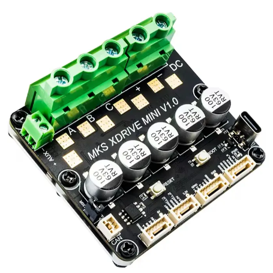
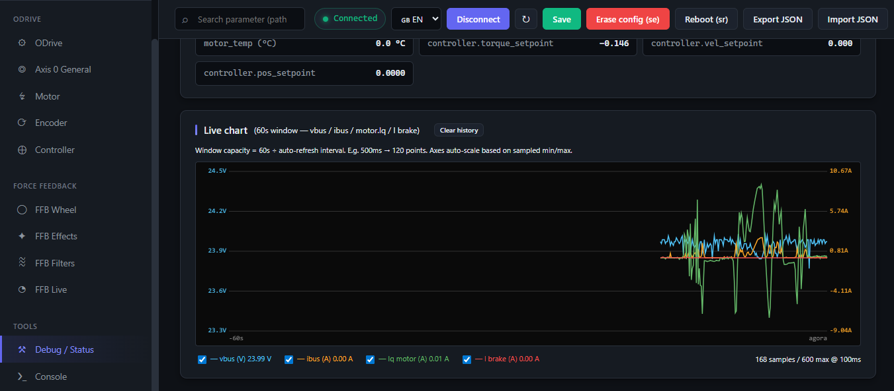
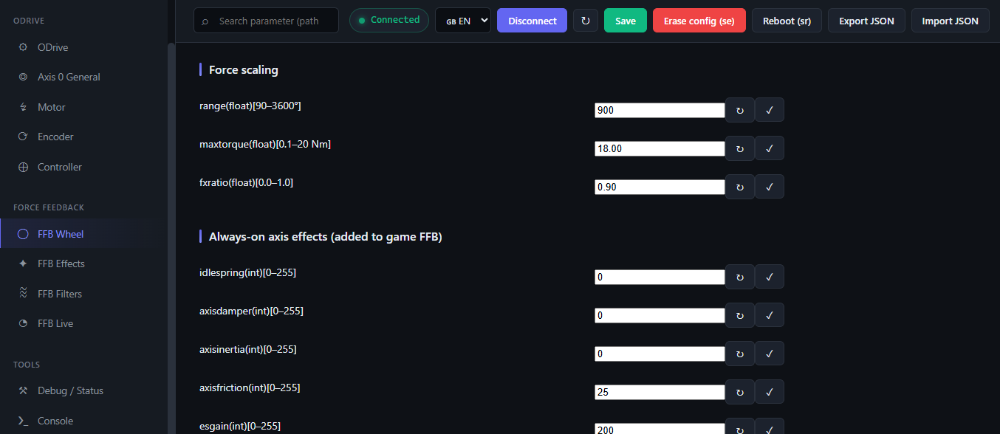
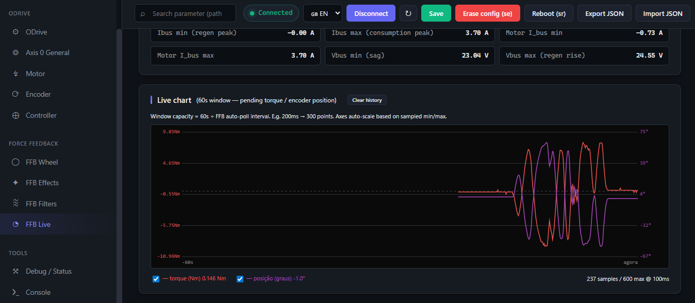

# Odrive-Wheel — MKS XDrive Mini FFB Firmware

Custom firmware for ODrive v0.5.6 running on **MKS XDrive Mini** hardware
(STM32F405-based clone of ODrive v3.6), adding full **HID Force Feedback**
support to use the motor as a sim racing wheel.

<p align="center">
  
</p>

Based on:
- [ODrive Firmware v0.5.6](https://github.com/odriverobotics/ODrive) (motor control)
- [OpenFFBoard](https://github.com/Ultrawipf/OpenFFBoard) (FFB stack: HidFFB + EffectsCalculator)

## 🚀 Quick start

New to the project? Read **[docs/GETTING_STARTED.md](docs/GETTING_STARTED.md)** for the full
step-by-step guide covering:

- Flashing a pre-built `.bin` (with `dfu-util` or directly from the browser)
- Compiling from source in VS Code
- **Minimum safe configuration** to bring the motor up the first time without
  blowing the brake resistor or tripping the PSU

## Repository structure

```
.
├── Odrive-Wheel/               ← Main project (CDC + HID composite + FFB)
│   ├── src/                    ← Local sources (USB, FFB bridge, cmd_table)
│   ├── inc/                    ← Local headers
│   ├── linker/                 ← Custom linker script (S0/S3-9 app, S10-11 EEPROM)
│   ├── tools/                  ← HTML config tool (Web Serial + WebUSB DFU, PT/EN i18n)
│   └── Makefile                ← Build via arm-none-eabi-gcc
├── ODrive-fw-v0.5.6/           ← ODrive firmware (with minimal patches)
├── OpenFFBoard-master/         ← Submodule → upstream Ultrawipf/OpenFFBoard
└── docs/                       ← Getting Started + screenshots
```

## What's been done

### Hardware supported
- MKS XDrive Mini (STM32F405RGT6, BLDC motor, ABZ encoder, brake resistor)

### FFB pipeline
- USB enumerates as **CDC + HID composite** (TinyUSB)
- HID descriptor: 2-axis PID gamepad (DirectInput / Windows FFB compatible)
- Game sends HID OUT reports → `HidFFB` → `EffectsCalculator` (1 kHz tick) → bridge → `axes[0].controller_.input_torque_` → motor
- Supports effects: **Constant Force**, **Spring**, **Damper**, **Friction**, **Inertia**, **Periodic** (Sine/Triangle/Square/etc.), **Ramp**

### Separated persistence
- ODrive NVM: sectors 1+2 (ODrive's native config_manager)
- FFB emulated EEPROM: sectors 10+11 (filters, gains, wheel params)
- No flash collision — firmware updates do not erase FFB settings

### HTML configuration tool
Tool at `Odrive-Wheel/tools/odrive-wheel.html` — opens directly in Chrome/Edge.

The tool uses **Web Serial API** to talk to the device and **WebUSB** for in-browser DFU flashing.
(Legacy version `odrive_config.html` is kept in the same folder for reference.)

Tabs:
- **ODrive** / **Axis 0** / **Motor** / **Encoder** / **Controller** — params via ODrive ASCII
- **FFB Wheel** — range, maxtorque, fxratio, axis effects (idlespring, damper, inertia, friction, esgain, slew, expo)
- **FFB Effects** — master gain + per-effect gains
- **FFB Filters** — biquad lowpass cutoff + Q per effect type
- **FFB Live** — live dashboard (FFB state, HID counters, active effects, bus current peaks, torque/position chart)
- **Debug / Status** — device info, state machine actions, decoded errors, live monitor, vbus/ibus/Iq/Ibrake chart
- **Console** — serial TX/RX log
- **DFU Flash** — re-flash the firmware from the browser (no `dfu-util` needed)

Each configurable field has a **tooltip explaining its function** on hover, and the UI supports **PT/EN** with a header toggle.

### In-browser DFU flasher (no external tool)
The firmware exposes the ASCII command `sd` that triggers a software-only jump
into the STM32 ROM bootloader (no BOOT0 jumper required). The HTML tool then
uses **WebUSB** to talk to the bootloader (`0483:DF11`) and runs the full
**DfuSe** programming sequence (erase application sectors → download → manifest)
right from the browser. After flashing, the board reboots into the new firmware
automatically.

The first flash still has to be done with `dfu-util` (Rota A in
[GETTING_STARTED.md](docs/GETTING_STARTED.md)) — but every subsequent update
can be done in the browser.

## Clone

`OpenFFBoard-master/OpenFFBoard-master/` is a **git submodule** pointing to upstream
[`Ultrawipf/OpenFFBoard`](https://github.com/Ultrawipf/OpenFFBoard) (currently locked at **v1.17.0**).
Clone with submodules:

```bash
git clone --recurse-submodules https://github.com/eagabriel/OpenffboardOdrive.git
```

If you already cloned without `--recurse-submodules`:
```bash
git submodule update --init --recursive
```

## Build

Prerequisites:
- `arm-none-eabi-gcc` (tested with 12.2)
- `make`
- `dfu-util` (only for the first flash; later updates can use the in-browser flasher)

```bash
cd Odrive-Wheel
make -j4
```

Artifact: `build/odrive-wheel.bin`

## Flash

You have three options. Full details in [GETTING_STARTED.md](docs/GETTING_STARTED.md).

### Option 1 — `dfu-util` (CLI, required for the first flash)

Put the board into DFU mode (hold BOOT0 + reset, or power-cycle with BOOT0 held), then:

```bash
make flash-dfu
```

Equivalent to:
```bash
dfu-util -d 0483:df11 -a 0 -s 0x08000000:leave -D build/odrive-wheel.bin
```

### Option 2 — In-browser DFU flasher (after the first flash)

Once the Odrive-Wheel firmware is on the board, you can update it without `dfu-util`:

1. Open `Odrive-Wheel/tools/odrive-wheel.html` in Chrome/Edge.
2. Connect to the board (Web Serial).
3. Open the **DFU Flash** tab in the sidebar.
4. Run the four steps: **Reboot to DFU → Find bootloader → Choose file → Flash firmware**.

On Windows, the STM32 bootloader needs the **WinUSB** driver (one-time setup
via [Zadig](https://zadig.akeo.ie/)). See `GETTING_STARTED.md` for details.

## Screenshots

The HTML configuration tool runs entirely in the browser via Web Serial API
(Chrome/Edge), with no install required.







## Updating OpenFFBoard upstream

Several FFB stack files (HidFFB, EffectsCalculator) were **forked and modified** locally in
`Odrive-Wheel/src/` and `inc/`. The originals live in the `OpenFFBoard-master/` submodule.

When upstream releases relevant updates, workflow:

```bash
# 1. Pull latest upstream commit into the submodule
git submodule update --remote OpenFFBoard-master/OpenFFBoard-master

# 2. See what changed
cd OpenFFBoard-master/OpenFFBoard-master
git log --oneline HEAD@{1}..HEAD          # new commits
git diff HEAD@{1}..HEAD --stat            # changed files
cd ../..

# 3. Compare our forks against the updated upstream
./Odrive-Wheel/tools/check-openffboard-upstream.sh           # summary
./Odrive-Wheel/tools/check-openffboard-upstream.sh --verbose # with diffs

# 4. For each file marked "DIVERGE" with relevant upstream changes,
#    manually integrate into our fork in Odrive-Wheel/

# 5. Compile + test
cd Odrive-Wheel && make -j4

# 6. Commit
git add OpenFFBoard-master/OpenFFBoard-master Odrive-Wheel/...
git commit -m "Bump OpenFFBoard upstream to <hash> + integrate changes"
```

Forked files have a header at the top indicating:
- Upstream version that was the fork base (commit hash)
- Description of local modifications
- Exact command to diff against upstream

E.g., `Odrive-Wheel/src/HidFFB.cpp` documents the `set_effect` modification for single-axis fallback.

## Licenses

This project combines code from multiple sources with different licenses:

- **ODrive Firmware** — MIT License — `ODrive-fw-v0.5.6/`
- **OpenFFBoard** — GPLv3 — `OpenFFBoard-master/`
- **Our own code** (`Odrive-Wheel/src`, `inc`, `tools`) — GPLv3 (compatible with OpenFFBoard)

Because GPL-licensed code from OpenFFBoard is included, the **combined work** (compiled firmware) is
distributed under **GPLv3**. See `LICENSE` at the repo root and individual licenses in subdirectories.

## Status

✅ Motor + encoder calibration working
✅ FFB validated: Spring / Constant / Friction / Periodic responding in ForceTest
✅ Brake resistor + regen stable (no PSU resets)
✅ Separated FFB / ODrive persistence
✅ Full HTML config tool in PT/EN
✅ In-browser DFU flasher (WebUSB + DfuSe)
✅ End-to-end validation in **iRacing**

## History

Built iteratively, in phases:

- **Phase 1** — ODrive v0.5.6 stock working + calibration
- **Phase 2a/b** — TinyUSB CDC + HID composite enumerating
- **Phase 2c** — FFB stack ported from OpenFFBoard
- **Phase 2d** — OpenFFBoard CmdParser via CDC (dual parser: ODrive ASCII + OpenFFBoard)
- **Phase 3** — FFB persistence in emulated EEPROM (S10+S11), full HTML tool, dashboards
- **Phase 4** — Project rename to **Odrive-Wheel**, in-browser DFU flasher (WebUSB + DfuSe), Getting Started guide
